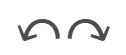
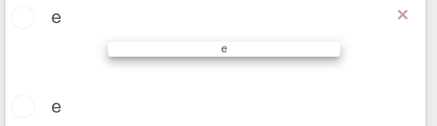
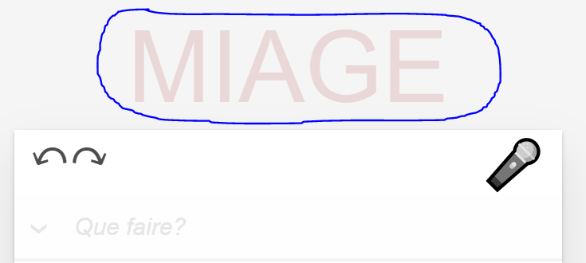
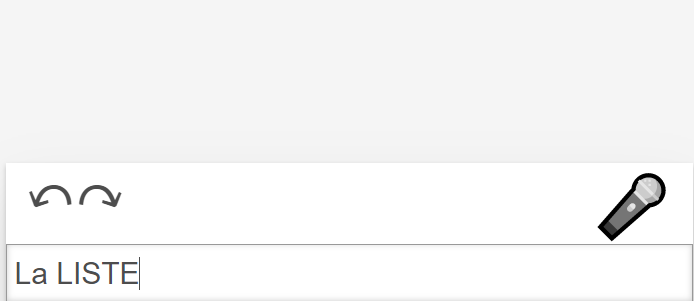
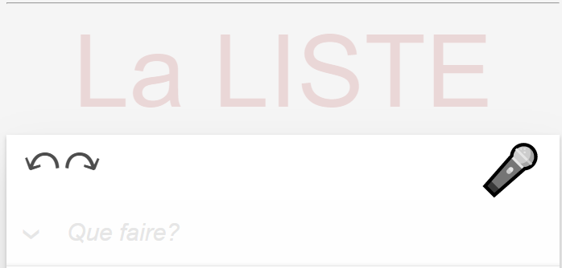
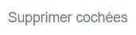
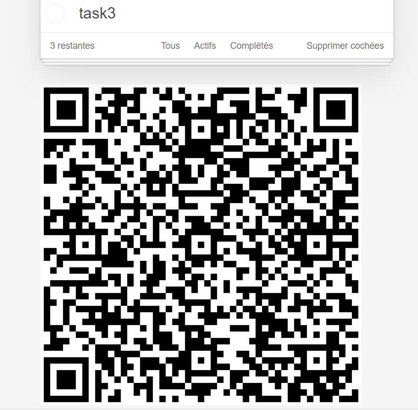
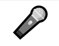

# PWA - TP3 - Todolist Angular

This project was generated with [Angular CLI](https://github.com/angular/angular-cli) version 11.0.1.

## Prérequis
- Installer [NodeJS](https://github.com/angular/angular-cli)
- Utiliser la commande `npm install` ou `npm i` pour installer les dépendances du projet

## Allumer le serveur

Utilisez la commande `ng serve` pour allumer le serveur de développement.

Une fois le serveur démarré vous pouvez accéder à l'application avec l'url suivant `http://localhost:4200/`.


## Fonctionnalités et réalisations

En plus des fonctionnalités déjà présentes dans le TP3-projet, voici les réalisations présentes dans mon projet.
Les fonctionnalités ont été testés sur `Microsoft Edge` et `Google Chrome`, veuillez utiliser l'un des deux pour ne pas rencontrer de problèmes.
### Application Responsive

L'application est utilisable sur téléphone, un maximum d'éléments sont gérés en %.

### Undo / Redo (Annuler / Refaire)

L'utilisateur à la possibilité d'annuler ses actions ou de les refaires après une annulation en cliquant sur les boutons ci-dessous.



### Drag&Drop pour réorganiser la liste

Pour organiser ses todo items dans l'ordre voulu, l'utilisateur peut drag and drop les items du bas vers le haut, ce qui change leurs places dans la liste.



### Edition du nom de la liste

L'utilisateur a la possibilité de renommer sa liste avec le titre qu'il souhaite en double cliquant dessus.





### Effacer Tout

l'utilisateur a la possibilité d'éffacer tous les todoitem ayant été complétés en cliquant sur le bouton `Supprimer cochées`.




### Copie de listes par QR-code

Si l'utilisateur veut transferer sa liste sur un autre support il a la possibilité de scanner le QrCode présent tout en bas de sa liste.

L'url de ce QrCode contient l'intégralité des informations de la liste, comme son nom et l'ensemble des items qu'elle contient.




Par exemple ce QrCode contient l'url suivant

http://localhost:4200/?data=

et ensuite les données sous forme de JSON : 
```json
{"label":"La LISTE","items":[{"label":"task1","isDone":false,"id":0},{"label":"task2","isDone":false,"id":2},{"label":"task3","isDone":false,"id":6}]}
```

Attention ! pour pouvoir la transferer sur son telephone le site devrait être hébergé sur un serveur et/ou posséder l'application sur son téléphone.
Pour tester, veuiller utiliser un autre navigateur. 

### Reconnaissance Vocale

Si l'utilisateur n'a pas envie d'écrire les différentes tâches, il peut utiliser le bouton `micro` afin de les dire à l'oral, l'application se chargera de comprendre ce que l'utilisateur a dit et l'ajouter à la liste.




